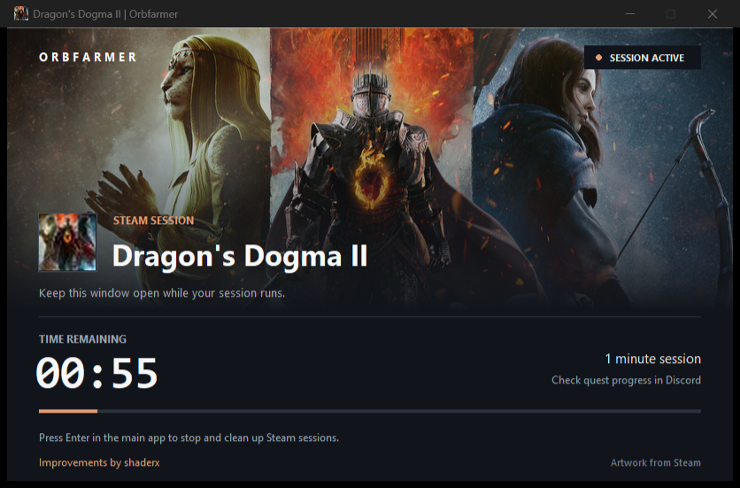

<div align="center">

# Orbfarmer

**Game sessions, thoughtfully presented.**

A Windows-first companion for Discord game-detection experiments.
Steam artwork. Visible timers. Local, scoped cleanup.

[](https://github.com/Shaderx/Orbfarmer/actions/workflows/release.yml)
[](https://github.com/Shaderx/Orbfarmer/releases/latest)
[](https://github.com/Shaderx/Orbfarmer/releases/latest)

[Get started](#get-started) · [Build](#build) · [Releases](https://github.com/Shaderx/Orbfarmer/releases)



</div>

### Small by design

- **Find a game** through Discord's database or Steam's catalog, or enter an executable path.
- **Keep it visible** with a game-themed window, Steam hero image and icon, sampled accent colors, and an elapsed-time counter (HH:MM:SS). Sessions run until you close the timer or stop them in the main app.
- **Keep it local** in `simulations/<game path>/` beside the app. No Steam-library edits, client injection, or automatic update installation.
- **Clean up deliberately.** Steam mode's Enter-to-stop action removes only that session's unchanged, owned files.

### Get started

Download `Orbfarmer-Windows-x86_64.zip` from [Releases](https://github.com/Shaderx/Orbfarmer/releases/latest), extract it into a writable folder, and launch `Orbfarmer.exe` with the Discord desktop app open. Choose a game and keep its timer window open. In Steam mode, return to the main wizard and press **Enter** to stop and clean up.

Windows is the current development and release focus. **macOS and Linux support is on hold for a future release.** Their initial v1.0.0 packages compiled successfully, but compilation does not establish working Discord detection or feature parity. Treat those existing downloads as experimental and unvalidated for everyday use; future releases currently package Windows only.

The counter measures local time, **not verified quest progress**. There is no 15-minute cutoff. Check Discord for detection and completion. Behavior varies by game; artwork falls back gracefully when unavailable.

### Build

Windows and Python 3.12 with Tcl/Tk are required for the supported build.

```powershell
git clone https://github.com/Shaderx/Orbfarmer.git
cd Orbfarmer
python -m venv .venv
.\.venv\Scripts\python -m pip install --only-binary=:all: -r requirements-build.txt
.\.venv\Scripts\python -m pytest -q
.\.venv\Scripts\python build.py
```

The executable is written to `dist-local/Orbfarmer.exe`. For source use, run `python orbfarmer.py` after installing `requirements.txt`.

Pushing a semantic-version tag such as `v1.2.3` automatically runs the tests, builds and packages Windows, generates checksums, and publishes a GitHub Release. Maintainers can also start the workflow manually from the [Actions page](https://github.com/Shaderx/Orbfarmer/actions/workflows/release.yml).

### Validation

The [v1.0.0 GitHub Actions run](https://github.com/Shaderx/Orbfarmer/actions/runs/34208339679) passed all **66 Windows tests**, built the executable with PyInstaller, and uploaded the release archive and `SHA256SUMS.txt`. The tests include timer-window visibility and deadline checks, configuration loading, scoped cleanup, and update-notification behavior. macOS and Linux each passed 64 tests with the two Windows window tests skipped; runtime support remains on hold.

To check a Windows download, compare this command's output with its entry in the release's `SHA256SUMS.txt`:

```powershell
Get-FileHash .\Orbfarmer-Windows-x86_64.zip -Algorithm SHA256
```

Checksums verify file integrity; they are not a publisher signature. Automated tests do not verify Discord quest completion or rewards.

Compiled builds create `settings.json` beside the executable. Sessions count up until stopped; the legacy `TIMER_MINUTES` setting is ignored. Defaults include `simulations/` output and `AUTO_DELETE: false`. Steam mode's explicit stop cleanup works independently of `AUTO_DELETE`; other modes use it for app-exit cleanup.

### Credits

Maintained by **shaderx** — detection fixes, scoped cleanup, artwork-driven UI, and the Orbfarmer redesign.

Based on [orbshacker](https://github.com/strykey/orbshacker), with original work credited to Strykey, Daniel Pires, and Pannenkoekisus. Steam artwork belongs to its respective owners. Original copyright and [license notices](LICENSE) are retained.

For educational use. Follow the applicable platform terms. No detection or reward guarantees.
